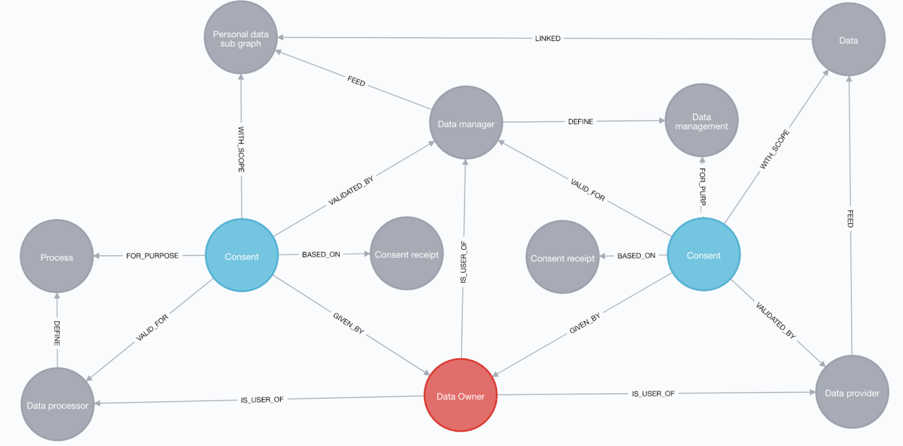

# ONTOLOGIES: OWL + WIDOCO + NETLIFY
This project describes the two ontologies used by https://www.datavillage.me to build the Digital Twins of people and to process these Digital Twins in a fully transparent way.
This project uses WIDICO (https://github.com/dgarijo/Widoco) to generate documentation of ontologies.
The generated ontology websites are automatically deployed on https://www.netlify.com.

## Digital-twin (ONGOING WORK)
It defines the way personal data are organised in the five Digital Twins.
- SOCIAL
- GEOSPATIAL
- KNOWLEDGE&INTEREST
- HEALTH
- CONSUMPTION

### Conceptual data model


| Nodes  | Description |
| ------------- | ------------- |
| Me  | The Person who owns the data and performs actions in real life digitized in his DigitalTwin.  |
| Entity | Entity is either a Person either an Organisation. |
| Organisation | An Organisation is an Entity. It’s a corporate, a governmental organisation, Startup, Restaurant, ... |
| Person | A Person is an Entity. |
| Place | A Place is a place represented by an address. |
| Transport | Means of transport used to move from one Location to another | 
| Product | Product Buy|Sell|Rent to an Entity at a specific Place. Products are categorized. |
| Media | Means of communication used by a Person. |
| Event | One thing that happens or happens, especially an important thing, that a person participates with others. |
| Activity | A move activity performed by a Person from one place to another. |
| Food | Any nutritious substance that a Person eat or drink. |
| Checkup | A thorough examination, especially a medical one, to detect any problems. |

### Ontology
The ontology is available here 
https://www.datavillage.me/ontologies/digital-twin/


## Consent (ONGOING WORK)
It formalizes the way in which consent is organized between the end user and organizations within a user-centric data management system.

### Conceptual data model


| Nodes  | Description |
| ------------- | ------------- |
| Data manager  | As Data processor, the Data manager helps the user to collects personal data from multiple Data provider after obtaining the Consent of the user. As Data provider, the Data manager helps the user to organise personal data for a specific Process.  |
| Data management | Specific process related to the management of personal data for the end user. |
| Personal data sub graph | Data source organised by the Data manager and processed by Data processor. The Personal data sub graph is a subset of all personal data of the user required for a specific Process. |
| Data Owner | A Person is an Entity who owns the data created through the services of Data provider.The Person is both a user of the Data provider and the Data processor. The Person is also a user of the Data manager. |
| Consent | Consent created by the data subject for a specific set of data, a specific process and for a given period of time. Taking into account that the Data management is also a Process and required a specific consent. |
| Consent receipt | Specific model is created for the consent related to the data management. | 
| Data provider | POrganisation that stores and provides data from data subject. . |
| Data | Original data source. |
| Data processor | Organisation that get the personal data from a Data provider after Consent is given by data subject and process data for the specific purpose. |
| Process | Type of processing performed on data. Taking into account that the Data management is also a Process. |

### Ontology
The ontology is available here 
https://www.datavillage.me/ontologies/consent/

https://www.datavillage.me/ontologies/consent/

## Deployment
### Make sure widoco jar file is included into your github repository
```
- Download widico executable https://github.com/dgarijo/WIDOCO/releases/tag/v1.4.12
- Include into your git repository
```
### Create your Netlify website
```
- Go to the "Sites" section  
- Create new website by using "New site from Git" button
- Connect with your Github account
- Choose your repository with containing your ontology .owl file
- Create your website
```
### Configure deployment
```
- Go in the "Deploys" section 
- Configure deployment settings by using "Deploy settings" button
- Edit settings
- In the "Build command" put the command: "java -jar PATH-TO-WIDOCO-JAR-IN-YOUR-REPO/widoco-1.4.12-jar-with-dependencies.jar -ontFile PATH-TO-OWL-FILEIN-YOUR-REPO -outFolder OUTPUT-FOLDER-USED-BY_NETLIFY-FOR-SITE-GENERATION -webVowl 
- In the "Publish directory" put OUTPUT-FOLDER-USED-BY_NETLIFY-FOR-SITE-GENERATION
- Save settings
```
### Deploy
```
- Do it manually via "Trigger deploy" button in the "Deploys" section
- Do it automatically by pushing your changes into your git repository on master branch.